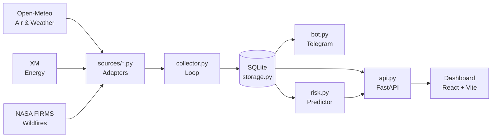
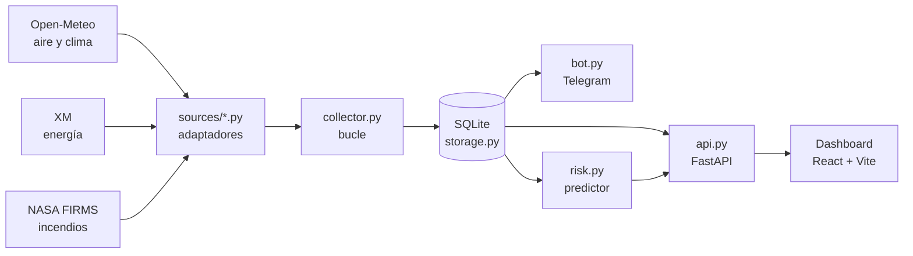

<div align="center">

# 🌤️ ClimaBot · Colombia

**Environmental monitoring platform for Colombia — 14 departmental capitals.**  
Air quality · Weather · Energy · Wildfires — Telegram alerts + real-time dashboard, all on open data.

[](https://github.com/Kromilla/clima-plataforma/actions/workflows/ci.yml)
[](LICENSE)
[](CONTRIBUTING.md)


**🌐 Language / Idioma:** [English](#english) · [Español](#español)

</div>

---

<a name="english"></a>

## English

### What it does

- 🌬️ **Air & Weather** — PM2.5, temperature and humidity with hourly trends.
- ⚡ **Energy** — carbon intensity of the Colombian electricity grid (XM).
- 🔥 **Wildfires** — satellite heat map (NASA FIRMS) with proximity alerts.
- 🌡️ **Heat Risk** — experimental extreme heat predictor powered by scikit-learn.
- 🤖 **Telegram Bot** — proactive PM2.5 and wildfire alerts + on-demand `/estado` (webhook mode).
- 🏙️ **14 cities** — Colombia's departmental capitals, switchable from the dashboard (default: Santa Marta).
- 🌗 **Dashboard** — React with light/dark mode, auto-reconnects if the backend goes down.

> **No air, weather, or energy source requires an API key.** The project runs end-to-end with only a Telegram token.

<!-- 📸 Add dashboard screenshots here (light and dark mode) -->
<!--  -->
<!--  -->

---

### How it works

Each external source is wrapped in an adapter with a uniform output shape. A collector queries them in a loop and persists the data. The API and the bot read from there.



**Golden rule:** adding a source = one file in `sources/` + one line in `sources/registry.py`. The bot, the API, and the dashboard are never touched. Adding the wildfire monitor (FIRMS) required no changes to any of the three.

---

### Data Sources

| Source | Data | API Key | Freshness |
|---|---|:---:|---|
| [Open-Meteo Air Quality](https://open-meteo.com) | PM2.5 (CAMS model) | No | Hourly |
| [Open-Meteo Forecast](https://open-meteo.com) | Temperature, humidity | No | Hourly |
| [XM](https://servapibi.xm.com.co) | Grid carbon intensity | No | ~2-3 day lag |
| [NASA FIRMS](https://firms.modaps.eosdis.nasa.gov) | Heat spots (VIIRS 375m) | Free | ~3 h |
| [Open-Meteo Archive](https://open-meteo.com) | ERA5 historical (for predictor) | No | ~6 day lag |
| [OpenAQ v3](https://api.openaq.org) | Physical stations | Yes | *no local coverage* |

OpenAQ does not cover Santa Marta or anywhere on Colombia's Caribbean coast. Open-Meteo (Copernicus CAMS model) was chosen as the air quality source — global coverage, no key required. XM, the official Colombian electricity market operator, publishes hourly carbon intensity for free without registration.

---

### Quick Start

**Requirements:** Python 3.11+, Node 20+.

```bash
# 1. Python environment
python -m venv .venv
.venv\Scripts\activate          # Windows
source .venv/bin/activate       # macOS / Linux
pip install -r requirements.txt

# 2. Secret guard (blocks committing keys by accident)
git config core.hooksPath .githooks

# 3. Environment variables (only Telegram is required)
cp .env.example .env            # paste your @BotFather token
python scripts/telegram_chat_id.py           # gets your TELEGRAM_CHAT_ID

# 4. Historical data for the predictor
python backfill.py --dias 730

# 5. Dashboard dependencies
npm install --prefix dashboard-ui
```

Start four processes (each in its own terminal):

```bash
python collector.py                    # collect and persist in a loop
python api.py                          # REST API on :8000
npm run dev --prefix dashboard-ui      # dashboard on :5173
python bot.py                          # Telegram bot
```

Air, weather, and energy work **without any API key**. `FIRMS_MAP_KEY` (free) is optional and only enables the wildfire map.

#### Data-only mode (no Telegram required)

```bash
python collector.py
python api.py                          # Swagger UI → http://localhost:8000/docs
npm run dev --prefix dashboard-ui
```

### Deployment

Free, no credit card: **Vercel** (dashboard) + **Render** (API + Telegram webhook)
+ **Supabase** (Postgres) + **GitHub Actions** (scheduled collector + keep-warm).
`storage.py` switches from SQLite to Postgres via a single env var (`DATABASE_URL`)
— thanks to the single-data-gateway design. The bot answers via **webhook** on the
same Render service (no 24/7 worker needed). Step-by-step in **[`deploy/DEPLOY.md`](deploy/DEPLOY.md)**.

Prefer a single always-on VM? See the Oracle Cloud Free alternative in
[`deploy/DEPLOY_oracle.md`](deploy/DEPLOY_oracle.md).

---

### REST API

The backend exposes a REST API at `http://localhost:8000`.

| Endpoint | Description |
|---|---|
| `GET /api/clima/actual` | Latest reading from every source |
| `GET /api/clima/historial?fuente=X` | Hourly time series for a source |
| `GET /api/estado/fuentes` | Health status (semaphore) per source |
| `GET /api/riesgo` | Heat risk prediction |
| `GET /api/incendios` | Active heat spots |
| `GET /api/lugares` | Configured locations |

**Interactive docs (Swagger UI):** `http://localhost:8000/docs`

---

### Tech Stack

| Layer | Technology |
|---|---|
| Backend | Python 3.11 · FastAPI · SQLite |
| Bot | python-telegram-bot |
| ML | scikit-learn · numpy |
| Frontend | React 19 · Vite · Tailwind CSS |
| Charts & Map | Recharts · Leaflet |
| Tests / CI | pytest · GitHub Actions |

---

### Design Principles

1. **One adapter per source** — adding a source = one file + register it.
2. **One location = one entry** in `locations.py`.
3. **One data gateway**: `storage.py`.
4. **Never crash** due to an external source going down.
5. **Never fake freshness** the data does not have.
6. **Configuration in `.env`**, never hardcoded.

Every source has a cascade fallback: **live API → SQLite cache → clear message**. Every reading carries its origin and age all the way to the UI — data from two days ago is shown as such, not disguised as live.

---

### File Structure

| File | Role |
|---|---|
| `config.py` | Loads and validates `.env` |
| `locations.py` | Flat location dictionary |
| `sources/base.py` | `Lectura`: value + origin + age |
| `sources/registry.py` | Single source registry |
| `storage.py` | SQLite: single data gateway + cache |
| `collector.py` | Queries all sources in a loop and persists |
| `backfill.py` | Fetches real ERA5 historical data for the predictor |
| `alerts.py` | PM2.5 threshold and proximity wildfire alert |
| `risk.py` | Heat risk predictor (Phase 4) |
| `bot.py` · `api.py` | Telegram bot · REST API |
| `dashboard-ui/` | React + Vite frontend |

---

### Tests

```bash
pytest tests/ -q
```

**134 tests, all offline** — API responses are recorded as fixtures. Every bug found by running the project left a regression test behind (see `tests/test_robustez.py`).

---

### Bot Commands

| Command | Description |
|---|---|
| `/estado` | Current air, weather, and energy readings |
| `/umbral N` | Change alert threshold (e.g. `/umbral 35`) |
| `/ayuda` | Command list |

---

### Troubleshooting

**Bot does not send automatic alerts**
Make sure the `[job-queue]` extra was installed: `pip install "python-telegram-bot[job-queue]>=20.7"`

**`collector.py` fails on first run**
The database is created automatically. If you see a "table not found" error, delete `clima.db` and restart.

**Wildfire tab missing from the dashboard**
`FIRMS_MAP_KEY` is required. Get it free at [firms.modaps.eosdis.nasa.gov/api/map_key](https://firms.modaps.eosdis.nasa.gov/api/map_key/).

**`npm audit` reports a high vulnerability**
The CSRF issue in `react-router-dom` is RSC-specific and does not apply to this SPA (`BrowserRouter`). Do not run `npm audit fix --force` — it would break the app.

**Predictor returns "insufficient data"**
Run the backfill: `python backfill.py --dias 730`

---

### Contributing

See [CONTRIBUTING.md](CONTRIBUTING.md) for the full guide — how to set up the environment, run tests, add a new data source, and open a pull request.

---

### License

[MIT](LICENSE) · Personal project by Carlos.

---
---

<a name="español"></a>

## Español

### Qué hace

- 🌬️ **Aire y clima** — PM2.5, temperatura y humedad, con tendencia horaria.
- ⚡ **Energía** — intensidad de carbono de la red eléctrica colombiana (XM).
- 🔥 **Incendios** — mapa de focos de calor por satélite (NASA FIRMS) con alerta por cercanía.
- 🌡️ **Riesgo de calor** — predictor experimental de calor extremo con scikit-learn.
- 🤖 **Bot de Telegram** — alertas proactivas de PM2.5 e incendios + comando `/estado` (modo webhook).
- 🏙️ **14 ciudades** — capitales departamentales de Colombia, cambiables desde el dashboard (default: Santa Marta).
- 🌗 **Dashboard** — React + modo claro/oscuro, se reconecta solo si el backend cae.

> **Ninguna de las fuentes de aire, clima o energía requiere API key.** El proyecto corre de punta a punta solo con un token de Telegram.

<!-- 📸 Agrega capturas del dashboard aquí (modo oscuro y claro) -->
<!--  -->
<!--  -->

---

### Cómo funciona

Cada fuente externa se envuelve en un adaptador con la misma forma de salida; un recolector las consulta en bucle y las persiste; la API y el bot leen de ahí.



**Regla de oro:** agregar una fuente = crear un archivo en `sources/` + una línea en `sources/registry.py`. El bot, la API y el dashboard **no se tocan**.

---

### Fuentes de datos

| Fuente | Datos | API key | Frescura |
|---|---|:---:|---|
| [Open-Meteo Air Quality](https://open-meteo.com) | PM2.5 (modelo CAMS) | No | Horaria |
| [Open-Meteo Forecast](https://open-meteo.com) | Temperatura, humedad | No | Horaria |
| [XM](https://servapibi.xm.com.co) | Intensidad de carbono de la red | No | ~2-3 días de rezago |
| [NASA FIRMS](https://firms.modaps.eosdis.nasa.gov) | Focos de calor (VIIRS 375 m) | Gratuita | ~3 h |
| [Open-Meteo Archive](https://open-meteo.com) | Histórico ERA5 (para el predictor) | No | ~6 días de rezago |
| [OpenAQ v3](https://api.openaq.org) | Estaciones físicas | Sí | *sin cobertura local* |

OpenAQ no tiene estaciones en Santa Marta ni en ningún punto de la costa Caribe colombiana. La fuente de aire pasó a Open-Meteo (modelo Copernicus CAMS): cobertura global, sin key. XM, el operador oficial del mercado eléctrico colombiano, publica la intensidad de carbono horaria gratis y sin registro.

---

### Inicio rápido

**Requisitos:** Python 3.11+, Node 20+.

```bash
# 1. Entorno de Python
python -m venv .venv
.venv\Scripts\activate          # Windows
source .venv/bin/activate       # macOS / Linux
pip install -r requirements.txt

# 2. Guard anti-secretos (bloquea subir claves por accidente)
git config core.hooksPath .githooks

# 3. Variables de entorno (solo Telegram es obligatorio)
cp .env.example .env            # pega tu token de @BotFather
python scripts/telegram_chat_id.py           # obtiene tu TELEGRAM_CHAT_ID

# 4. Historial para el predictor
python backfill.py --dias 730

# 5. Dependencias del dashboard
npm install --prefix dashboard-ui
```

Luego se levantan cuatro procesos (cada uno en su terminal):

```bash
python collector.py                    # recolecta y persiste en bucle
python api.py                          # API REST en :8000
npm run dev --prefix dashboard-ui      # dashboard en :5173
python bot.py                          # bot de Telegram
```

Aire, clima y energía funcionan **sin ninguna API key**. `FIRMS_MAP_KEY` (gratuita) es opcional y solo activa el mapa de incendios.

#### Modo sin Telegram (solo datos)

```bash
python collector.py
python api.py                          # Swagger UI → http://localhost:8000/docs
npm run dev --prefix dashboard-ui
```

---

### API REST

El backend expone una API REST en `http://localhost:8000`.

| Endpoint | Descripción |
|---|---|
| `GET /api/clima/actual` | Última lectura de cada fuente |
| `GET /api/clima/historial?fuente=X` | Serie horaria de una fuente |
| `GET /api/estado/fuentes` | Estado de salud (semáforo) por fuente |
| `GET /api/riesgo` | Predicción de riesgo de calor |
| `GET /api/incendios` | Focos de calor activos |
| `GET /api/lugares` | Lugares configurados |

**Documentación interactiva (Swagger UI):** `http://localhost:8000/docs`

---

### Stack

| Capa | Tecnología |
|---|---|
| Backend | Python 3.11 · FastAPI · SQLite |
| Bot | python-telegram-bot |
| ML | scikit-learn · numpy |
| Frontend | React 19 · Vite · Tailwind CSS |
| Gráficas y mapa | Recharts · Leaflet |
| Tests / CI | pytest · GitHub Actions |

---

### Diseño

#### Nunca crashear, nunca fingir precisión

Cada fuente cae en cascada: **API → caché SQLite → mensaje claro**. Toda lectura arrastra su procedencia y antigüedad hasta la UI: un dato de hace dos días se muestra como tal, no disfrazado de dato en vivo.

#### Principios

1. **Un adaptador por fuente** — agregar una fuente = un archivo + registrarlo.
2. **Un lugar = una entrada** en `locations.py`.
3. **Una sola puerta a los datos**: `storage.py`.
4. **Nunca crashear** por una fuente externa caída.
5. **Nunca fingir frescura** que el dato no tiene.
6. **Configuración en `.env`**, nunca hardcodeada.

---

### Estructura

| Archivo | Rol |
|---|---|
| `config.py` | Carga y valida `.env` |
| `locations.py` | Diccionario plano de lugares |
| `sources/base.py` | `Lectura`: valor + procedencia + antigüedad |
| `sources/registry.py` | Registro único de fuentes |
| `storage.py` | SQLite: única puerta a los datos + caché |
| `collector.py` | Consulta todas las fuentes en bucle y persiste |
| `backfill.py` | Trae histórico real para el predictor |
| `alerts.py` | Umbral de PM2.5 y alerta por foco cercano |
| `risk.py` | Predictor de riesgo de calor |
| `bot.py` · `api.py` | Bot de Telegram · API REST |
| `dashboard-ui/` | Frontend React + Vite |

---

### Tests

```bash
pytest tests/ -q
```

**134 tests, todos sin conexión a internet** — las respuestas de las APIs están grabadas como fixtures. Cada bug encontrado ejecutando el proyecto dejó su test de regresión (ver `tests/test_robustez.py`).

---

### Comandos del bot

| Comando | Descripción |
|---|---|
| `/estado` | Aire, clima y energía actuales |
| `/umbral N` | Cambiar umbral de alerta (ej. `/umbral 35`) |
| `/ayuda` | Lista de comandos |

---

### Troubleshooting

**El bot no envía alertas automáticas**
Instala el extra `[job-queue]`: `pip install "python-telegram-bot[job-queue]>=20.7"`

**`collector.py` falla al arrancar desde cero**
La base de datos se crea automáticamente. Si ves error de tabla, elimina `clima.db` y reinicia.

**La pestaña de incendios no aparece**
Requiere `FIRMS_MAP_KEY` en el `.env`. Consíguela gratis en [firms.modaps.eosdis.nasa.gov/api/map_key](https://firms.modaps.eosdis.nasa.gov/api/map_key/).

**`npm audit` reporta una vulnerabilidad alta**
El fallo CSRF en `react-router-dom` es específico de RSC; no aplica a este SPA con `BrowserRouter`. No ejecutes `npm audit fix --force`.

**El predictor devuelve "datos insuficientes"**
Ejecuta el backfill: `python backfill.py --dias 730`

---

### Contribuir

Consulta [CONTRIBUTING.md](CONTRIBUTING.md) — cómo configurar el entorno, correr los tests, añadir una nueva fuente de datos y abrir un pull request.

---

### Licencia

[MIT](LICENSE) · Proyecto personal de Carlos.
