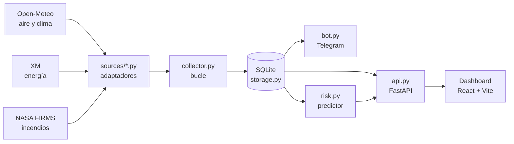

<div align="center">

# 🌤️ ClimaBot · Santa Marta

**Monitor de calidad del aire, clima, energía e incendios para Santa Marta, Colombia.**
Bot de alertas por Telegram + dashboard en tiempo real, todo sobre datos abiertos.

[](https://github.com/Kromilla/clima-plataforma/actions/workflows/ci.yml)
[](LICENSE)


</div>

---

## Qué hace

- 🌬️ **Aire y clima** — PM2.5, temperatura y humedad, con tendencia horaria.
- ⚡ **Energía** — intensidad de carbono de la red eléctrica colombiana (XM).
- 🔥 **Incendios** — mapa de focos de calor por satélite (NASA FIRMS) con alerta por cercanía.
- 🌡️ **Riesgo de calor** — predictor experimental de calor extremo con scikit-learn.
- 🤖 **Bot de Telegram** — alertas de PM2.5 y comando `/estado` bajo demanda.
- 🌗 **Dashboard** — React + modo claro/oscuro, se reconecta solo si el backend cae.

> **Ninguna de las fuentes de aire, clima o energía requiere API key.** El proyecto
> corre de punta a punta solo con un token de Telegram.

<!-- 📸 Sugerencia: agrega aquí 1-2 capturas del dashboard (claro y oscuro). -->

---

## Cómo funciona

Cada fuente externa se envuelve en un adaptador con la misma forma de salida; un
recolector las consulta en bucle y las persiste; la API y el bot leen de ahí.



**Regla de oro:** agregar una fuente = crear un archivo en `sources/` + una línea
en `sources/registry.py`. El bot, la API y el dashboard **no se tocan**. Sumar el
monitor de incendios (FIRMS) no requirió modificar ninguno de los tres.

---

## Fuentes de datos

| Fuente | Datos | API key | Frescura |
|---|---|:---:|---|
| [Open-Meteo Air Quality](https://open-meteo.com) | PM2.5 (modelo CAMS) | No | Horaria |
| [Open-Meteo Forecast](https://open-meteo.com) | Temperatura, humedad | No | Horaria |
| [XM](https://servapibi.xm.com.co) | Intensidad de carbono de la red | No | ~2-3 días de rezago |
| [NASA FIRMS](https://firms.modaps.eosdis.nasa.gov) | Focos de calor (VIIRS 375 m) | Gratuita | ~3 h |
| [Open-Meteo Archive](https://open-meteo.com) | Histórico ERA5 (para el predictor) | No | ~6 días de rezago |
| [OpenAQ v3](https://api.openaq.org) | Estaciones físicas | Sí | *sin cobertura local* |

### 🔍 Por qué estas fuentes y no otras

El plan original no sobrevivió al contacto con las APIs reales. Dos hallazgos
cambiaron el rumbo antes de escribir el bot:

- **OpenAQ no cubre Santa Marta** — ni la ciudad, ni Barranquilla, ni la costa
  Caribe. Verificado contra las 66 estaciones que OpenAQ tiene en toda Colombia
  (Bogotá, Medellín, Cali, Bucaramanga). La fuente de aire pasó a **Open-Meteo**
  (modelo Copernicus CAMS): cobertura global, sin key.
- **Electricity Maps se reemplazó por XM** — su tier gratuito era ambiguo y de una
  sola zona. **XM**, el operador oficial del mercado eléctrico colombiano, publica
  la intensidad de carbono horaria gratis y sin registro.

> Corpamag opera ~14 estaciones reales entre Santa Marta y Ciénaga, publicadas en
> [datos.gov.co](https://www.datos.gov.co/resource/dgnf-6h7v.json), pero con ~3
> meses de rezago: sirve como contexto histórico, no para alertas.

---

## Inicio rápido

**Requisitos:** Python 3.11+, Node 20+.

```bash
# 1. Entorno de Python
python -m venv .venv && .venv/Scripts/activate   # Windows
pip install -r requirements.txt

# 2. Variables de entorno (solo Telegram es obligatorio)
cp .env.example .env        # y pega tu token de @BotFather
python dia1_chatid.py       # obtiene tu TELEGRAM_CHAT_ID

# 3. Historial para el predictor (datos reales del archivo ERA5)
python backfill.py --dias 730

# 4. Dependencias del dashboard
npm install --prefix dashboard-ui
```

Luego se levantan cuatro procesos (cada uno en su terminal):

```bash
python collector.py                    # recolecta y persiste en bucle
python api.py                          # API REST en :8000
npm run dev --prefix dashboard-ui      # dashboard en :5173
python bot.py                          # bot de Telegram
```

Aire, clima y energía funcionan **sin ninguna API key**. `FIRMS_MAP_KEY` (gratuita)
es opcional y solo activa el mapa de incendios.

---

## Stack

| Capa | Tecnología |
|---|---|
| Backend | Python 3.11 · FastAPI · SQLite |
| Bot | python-telegram-bot |
| ML | scikit-learn · numpy |
| Frontend | React 19 · Vite · Tailwind CSS |
| Gráficas y mapa | Recharts · Leaflet |
| Tests / CI | pytest · GitHub Actions |

---

## Diseño

### Nunca crashear, nunca fingir precisión

Cada fuente cae en cascada: **API → caché SQLite → mensaje claro**. Toda lectura
arrastra su procedencia y antigüedad hasta la UI: un dato de hace dos días se
muestra como tal, no disfrazado de dato en vivo. Los umbrales del semáforo son por
fuente, porque el rezago de XM es normal y no una falla.

### El predictor de riesgo (Fase 4)

Estima la probabilidad de que el **índice de calor** (temperatura + humedad, fórmula
de la NOAA) supere 39 °C al día siguiente — se usa índice de calor y no temperatura
seca porque en una ciudad costera la humedad es la que vuelve peligroso el calor.

La validación es **cronológica**: entrena con el pasado y evalúa con los días
siguientes; una partición aleatoria filtraría el futuro e inflaría las métricas. Se
reporta siempre la **mejora sobre la referencia** (acertar la clase mayoritaria),
porque una exactitud alta puede ocultar un modelo inútil. Va etiquetado como
**estimación experimental** en todas las capas — no es una alerta oficial.

### Principios

1. **Un adaptador por fuente** — agregar una fuente = un archivo + registrarlo.
2. **Un lugar = una entrada** en `locations.py`.
3. **Una sola puerta a los datos**: `storage.py`.
4. **Nunca crashear** por una fuente externa caída.
5. **Nunca fingir frescura** que el dato no tiene.
6. **Configuración en `.env`**, nunca hardcodeada.

---

## Estructura

| Archivo | Rol |
|---|---|
| `config.py` | Carga y valida `.env` |
| `locations.py` | Diccionario plano de lugares |
| `sources/base.py` | `Lectura`: valor + procedencia + antigüedad |
| `sources/registry.py` | Registro único de fuentes |
| `storage.py` | SQLite: única puerta a los datos + caché |
| `collector.py` | Consulta todas las fuentes en bucle y persiste |
| `backfill.py` | Trae histórico real para el predictor |
| `alerts.py` | Umbral de PM2.5 y alerta por foco cercano |
| `risk.py` | Predictor de riesgo de calor (Fase 4) |
| `bot.py` · `api.py` | Bot de Telegram · API REST |
| `dashboard-ui/` | Frontend React + Vite |

---

## Tests

```bash
pytest tests/ -q
```

**98 tests, todos sin conexión a internet** — las respuestas de las APIs están
grabadas como fixtures. Cada corrección de bug encontrada ejecutando el proyecto
dejó su test de regresión (ver `tests/test_robustez.py`).

---

## Comandos del bot

| Comando | Descripción |
|---|---|
| `/estado` | Aire, clima y energía actuales |
| `/umbral N` | Cambiar umbral de alerta (ej. `/umbral 35`) |
| `/ayuda` | Lista de comandos |

---

## Notas

- **Alcance v1:** una ciudad (Santa Marta). La arquitectura soporta más lugares
  con una entrada en `locations.py`; la API ya expone la lista.
- **Vulnerabilidad conocida:** `npm audit` marca un fallo alto en `react-router-dom`
  (CSRF en modo RSC). No aplica: es un SPA con `BrowserRouter`, sin RSC. `npm audit
  fix --force` degradaría a un major anterior y rompería la app.

---

## Licencia

[MIT](LICENSE) · Proyecto personal de Carlos.
